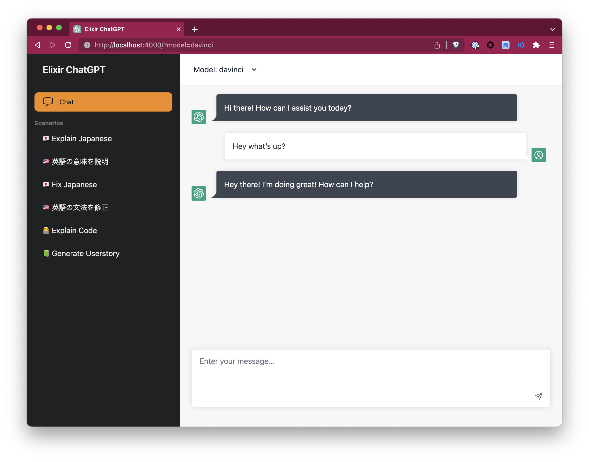
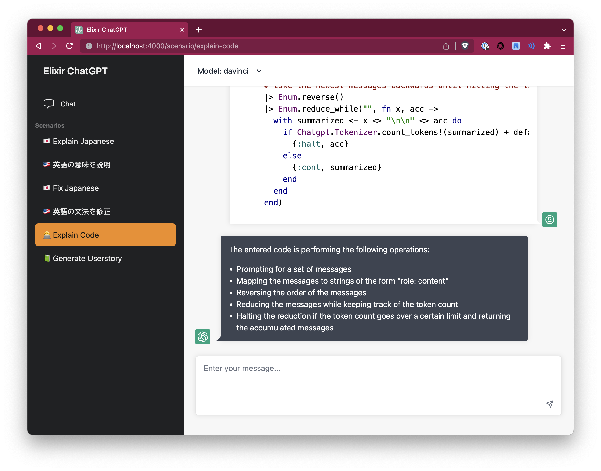

# ChatGPT UI

ChatGPT to host yourself, targeted at business-ey usecases that may be useful within a company, written in Elixir + LiveView



## What is this?

The goal is to create a simple ChatGPT UI that uses the OpenAI APIs directly, for you and your company to self-host.

### Why?

According to the [OpenAI API Usage Policy](https://openai.com/policies/api-data-usage-policies), data from ChatGPT usage will be used to train their models. Usage of the API however, will not.

Some companies want to offer ChatGPT internally to their employees, but without having company data end up in the training set.

## Features

- "Scenarios" for repetitive tasks you find yourself doing a lot
- Use your own OpenAI API key
- Google OAuth authentication
- Restrict access to certain email domains
- Set which model to use
- Code highlighting with [highlightjs](https://highlightjs.org/)
- Streaming messages support
- Dark Mode
- Ability to use "text-davinci-003" (GPT3), despite it not being a model for chatting
- Automatic content truncating based on token count with [bert-base-multilingual-uncased](https://huggingface.co/bert-base-multilingual-uncased)

## Configuration

In config.exs, you can set the following keys:

```elixir
config :chatgpt,
  title: "Elixir ChatGPT",
  enable_google_oauth: true,
  restrict_email_domains: false,
  allowed_email_domains: ["google.com"]

  default_model: :"gpt-3.5-turbo",
  models: [
    %{
      id: :gpt4,
      truncate_tokens: 8000 # this key is not being used yet, but will be in a future version
    },
    %{
      id: :"gpt-3.5-turbo",
      truncate_tokens: 4000
    },
    %{
      id: :davinci,
      truncate_tokens: 2200
    }
  ],
```

Then in `runtime.exs`:

```elixir

# generate them at https://platform.openai.com/account/api-keys
config :ex_openai,
  api_key: System.get_env("OPENAI_API_KEY"),
  organization_key: System.get_env("OPENAI_ORGANIZATION_KEY"),
  http_options: [recv_timeout: 50_000]

# If you set `enable_google_oauth`, also set the following keys: (by default, uses the environment variables)
# check https://github.com/dwyl/elixir-auth-google/blob/main/create-google-app-guide.md on how to get these keys

config :elixir_auth_google,
  client_id: System.get_env("GOOGLE_AUTH_CLIENT_ID"),
  client_secret: System.get_env("GOOGLE_AUTH_CLIENT_SECRET")
```

## Scenarios



This UI decided to go with "scenarios" instead of the usual "recent conversations" approach of the official ChatGPT.

"Scenarios" are preconfigured tasks that the AI should do, ready to be bookmarked and used whenever the task needs to be done. These can be things like:

- Rewriting JIRA tickets
- Grading user stories
- Explaining code
- Rephrasing based on corporate language

Currently, scenarios are set in `scenario.ex` and follow the `%ChatgptWeb.Scenario` struct:

```elixir
      %{
        id: "generate-userstory",
        name: "📗 Generate Userstory",
        description:
          "Give me the content of a ticket, and I will try to write a user story for you!",
        messages: [
          %ChatgptWeb.Message{
            content:
              "You are an assistant that generates user stories for tickets. First, take the inputted text and give a summary if the entered text is a good userstory or not, with explanation why.\nThen, generate a proper user-story with the inputted text in the format of 'As a X, I want to Y, so that I can Z'.",
            sender: :system
          }
        ],
        keep_context: false
      }
```

- messages are instructions to send to ChatGPT when the scenario is loaded, typically instructing the AI what it should do. Use `:system` messages to provide admin commands. The 3.5-turbo model is not paying so much attention to system messages, so experiment with using `:user` instead.
- `keep_context` specifies whether the conversation context should be kept. If this is set to false (recommended), each message that is sent to the AI will be treated as a new conversation, the AI will have no context on previously sent messages.

## Usage

Run with `mix phx.server`

## Usage / Deploying with Docker

First of all, generate a new random keybase: `mix phx.gen.secret`. A default is set, but you should _really_ change this before deploying.

```
docker build . -t chatgpt
docker run -e SECRET_KEY_BASE=<keybase here> -e HOST="localhost" -p 4000:4000 chatgpt
```

The container (by default) expects the following env vars (unless you changed it in `runtime.exs`):

- HOST
- PORT (default 4000)
- SECRET_KEY_BASE
- OPENAI_API_KEY
- OPENAI_ORGANIZATION_KEY

And if you use google:

- GOOGLE_AUTH_CLIENT_ID
- GOOGLE_AUTH_CLIENT_SECRET

## Status

Super work-in-progress
